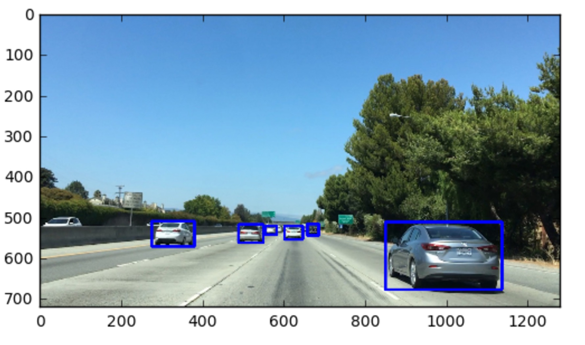
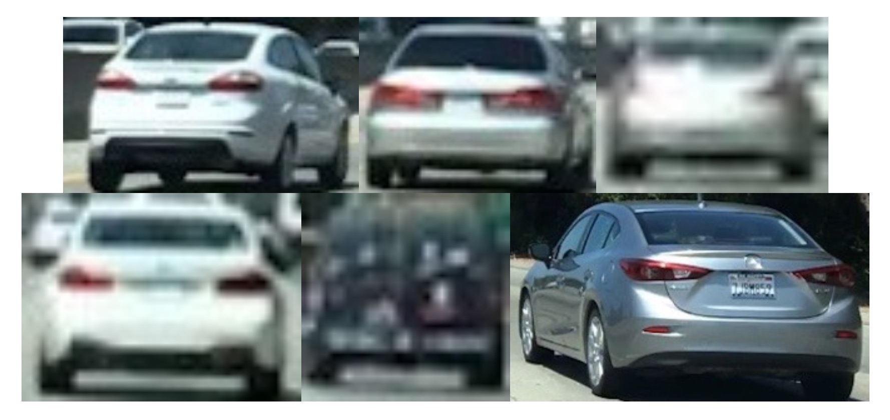
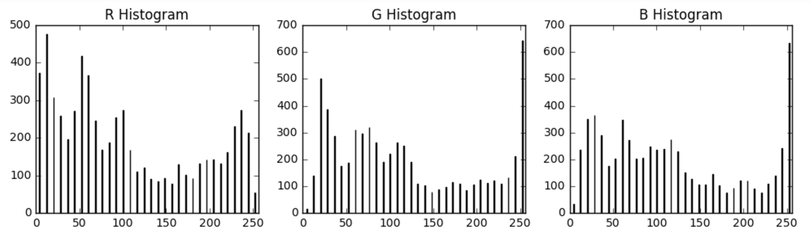
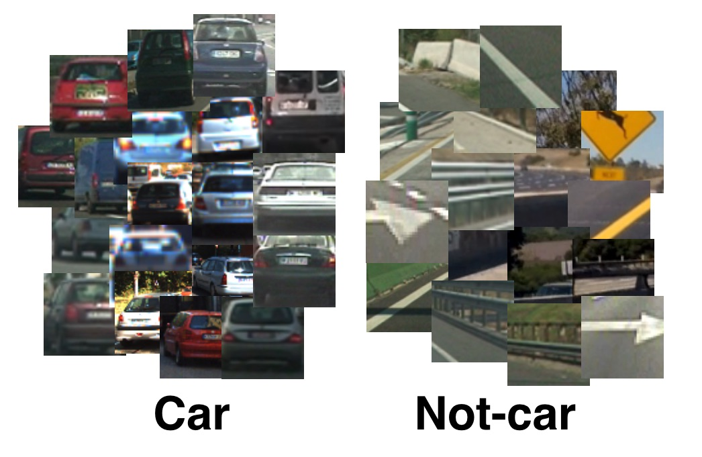
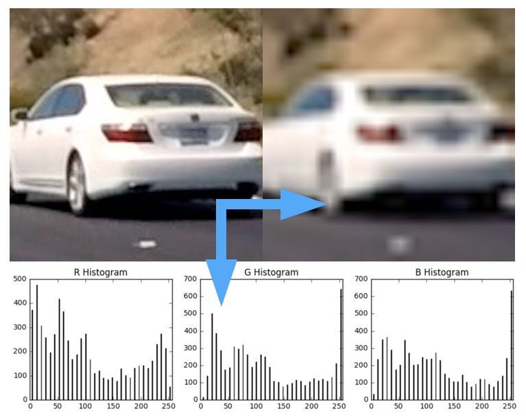
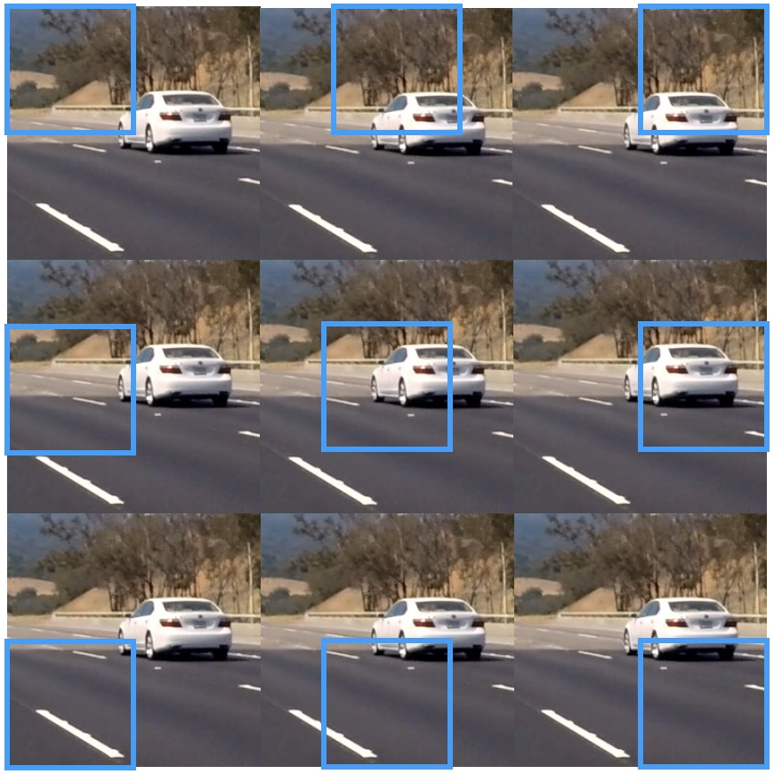
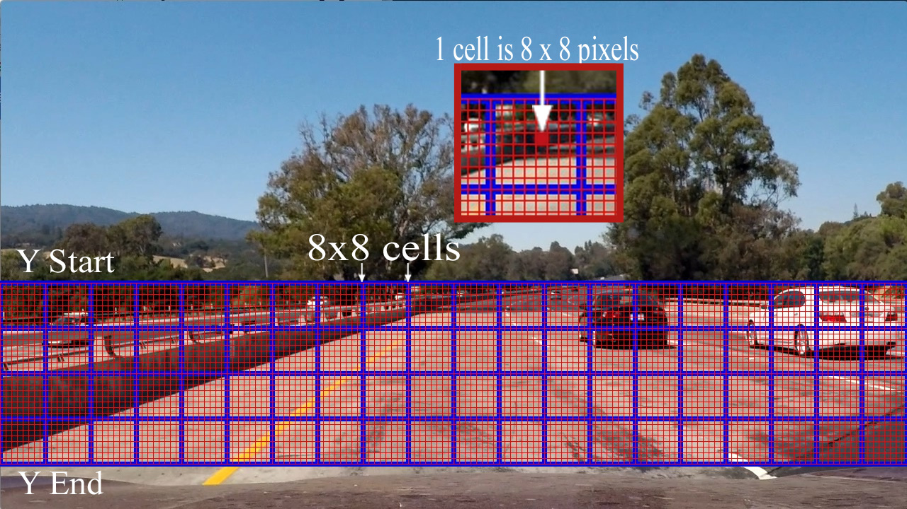
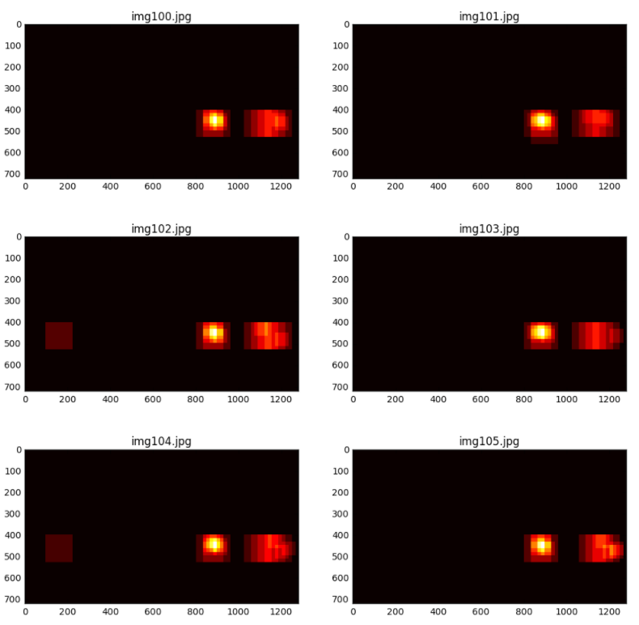

# Object Detection

## Manual Vehicle Detection

[manual_vehicle_detection.ipynb](https://github.com/jeongwhanchoi/object-detection/blob/master/manual_vehicle_detection.ipynb)


Here's your chance to be a human vehicle detector! In this lesson, you will be drawing a lot of bounding boxes on vehicle positions in images. Eventually, you'll have an algorithm that's outputting bounding box positions and you'll want an easy way to plot them up over your images. So, now is a good time to get familiar with the `cv2.rectangle()` function ([documentation](https://docs.opencv.org/2.4/modules/core/doc/drawing_functions.html)) that makes it easy to draw boxes of different size, shape and color.

In this exercise, your goal is to write a function that takes as arguments an image and a list of bounding box coordinates for each car. Your function should then draw bounding boxes on a copy of the image and return that as its output.

**Your output should look something like this:**


Here, I don't actually care whether you identify the same cars as I do, or that you draw the same boxes, only that your function takes the appropriate inputs and yields the appropriate output. So here's what it should look like:

```python
# Define a function that takes an image, a list of bounding boxes, 
# and optional color tuple and line thickness as inputs
# then draws boxes in that color on the output

def draw_boxes(img, bboxes, color=(0, 0, 255), thick=6):
    # make a copy of the image
    # draw each bounding box on your image copy using cv2.rectangle()
    # return the image copy with boxes drawn
```

You'll draw bounding boxes with `cv2.rectangle()` like this:

```python
cv2.rectangle(image_to_draw_on, (x1, y1), (x2, y2), color, thick)
```

In this call to `cv2.rectangle()` your image_to_draw_on should be the copy of your image, then `(x1, y1)` and `(x2, y2)` are the x and y coordinates of any two opposing corners of the bounding box you want to draw. `color` is a 3-tuple, for example, `(0, 0, 255)` for blue, and `thick` is an optional integer parameter to define the box thickness.

Have a look at the image above with labeled axes, where I've drawn some bounding boxes and "guesstimate" where some of the box corners are. You should pass your bounding box positions to your `draw_boxes()` function as a list of tuple pairs, like this:

```python
bboxes = [((x1, y1), (x2, y2)), ((,),(,)), ...]
```
## Template Matching

[template_matching.ipynb](https://github.com/jeongwhanchoi/object-detection/blob/master/template_matching.ipynb)


To figure out when template matching works and when it doesn't, let's play around with the OpenCV `cv2.matchTemplate()` function! In the bounding boxes exercise, I found six cars in the image above. This time, we're going to play the opposite game. Assuming we know these six cars are what we're looking for, we can use them as templates and search the image for matches.



The goal in this exercise is to write a function that takes in an image and a list of templates, and returns a list of the best fit location (bounding box) for each of the templates within the image. OpenCV provides you with the handy function `cv2.matchTemplate()` ([documentation](https://docs.opencv.org/2.4/modules/imgproc/doc/object_detection.html)) to search the image, and `cv2.minMaxLoc()` ([documentation](https://docs.opencv.org/2.4/modules/core/doc/operations_on_arrays.html?highlight=minmaxloc#cv2.minMaxLoc)) to extract the location of the best match.

You can choose between "squared difference" or "correlation" methods in using `cv2.matchTemplate()`, but keep in mind with squared differences you need to locate the global minimum difference to find a match, while for correlation, you're looking for a global maximum.

Follow along with [this tutorial](http://opencv-python-tutroals.readthedocs.io/en/latest/py_tutorials/py_imgproc/py_template_matching/py_template_matching.html) provided by OpenCV to try some different template matching techniques. The function you write should work like this:

```python
def find_matches(img, template_list):
    # Iterate over the list of templates
    # Use cv2.matchTemplate() to search the image for each template
    # NOTE: You can use any of the cv2.matchTemplate() search methods
    # Use cv2.minMaxLoc() to extract the location of the best match in each case
    # Compile a list of bounding box corners as output
    # Return the list of bounding boxes
```


**However**, the point of this exercise is not to discover why template matching works for vehicle detection, but rather, why it doesn't! So, after you have a working implementation of the `find_matches()` function, try it on the second image, `temp-matching-example-2.jpg`, which is currently commented out.

In the second image, all of the same six cars are visible (just a few seconds later in the video), but you'll find that **none** of the templates find the correct match! This is because with template matching we can only find very close matches, and changes in size or orientation of a car make it impossible to match with a template.

So, just to be clear, the goal here is to:

- Write a function that takes in an image and list of templates and returns a list of bounding boxes.
- Find that your function works well to locate the six example templates taken from the first image.
- Try your code on the second image, and find that template matching breaks easily.

## Spatial Binning of Color

[spatial_binning_of_color.ipynb](https://github.com/jeongwhanchoi/object-detection/blob/master/spatial_binning_of_color.ipynb)

You saw earlier in the lesson that template matching is not a particularly robust method for finding vehicles unless you know exactly what your target object looks like. However, raw pixel values are still quite useful to include in your feature vector in searching for cars.

While it could be cumbersome to include three color channels of a full resolution image, you can perform spatial binning on an image and still retain enough information to help in finding vehicles.

As you can see in the example above, even going all the way down to 32 x 32 pixel resolution, the car itself is still clearly identifiable by eye, and this means that the relevant features are still preserved at this resolution.

A convenient function for scaling down the resolution of an image is OpenCV's `cv2.resize()`.

```python
import cv2
import matplotlib.image as mpimg

image = mpimg.imread('test_img.jpg')
small_img = cv2.resize(image, (32, 32))
print(small_img.shape)
(32, 32, 3)
```
If you then wanted to convert this to a one dimensional [feature vector](https://en.wikipedia.org/wiki/Feature_(machine_learning)), you could simply say something like:
```python
feature_vec = small_img.ravel()
print(feature_vec.shape)
(3072,)
```

Ok, but 3072 elements is still quite a few features! Could you get away with even lower resolution? I'll leave that for you to explore later when you're training your classifier.

Now that you've played with color spaces a bit, it's probably a good time to write a function that allows you to convert any test image into a feature vector that you can feed your classifier. Your goal in this exercise is to write a function that takes an image, a color space conversion, and the resolution you would like to convert it to, and returns a feature vector. Something like this:
```python
# Define a function that takes an image, a color space, 
# and a new image size
# and returns a feature vector
def bin_spatial(img, color_space='RGB', size=(32, 32)):
    # Convert image to new color space (if specified)
    # Use cv2.resize().ravel() to create the feature vector
    # Return the feature vector
```
## Histograms of Color

[histogram_of_color.ipynb](https://github.com/jeongwhanchoi/object-detection/blob/master/histogram_of_color.ipynb)


You can construct histograms of the R, G, and B channels like this:

```python
import matplotlib.image as mpimg
import numpy as np

# Read in the image
image = mpimg.imread('cutout1.jpg')

# Take histograms in R, G, and B
rhist = np.histogram(image[:,:,0], bins=32, range=(0, 256))
ghist = np.histogram(image[:,:,1], bins=32, range=(0, 256))
bhist = np.histogram(image[:,:,2], bins=32, range=(0, 256))
```

With `np.histogram()`, you don't actually have to specify the number of bins or the range, but here I've arbitrarily chosen 32 bins and specified `range=(0, 256)` in order to get orderly bin sizes. `np.histogram()` returns a tuple of two arrays. In this case, for example, `rhist[0]` contains the counts in each of the bins and `rhist[1]` contains the bin edges (so it is one element longer than `rhist[0]`).

To look at a plot of these results, we can compute the bin centers from the bin edges. Each of the histograms in this case have the same bins, so I'll just use the rhist bin edges:

```python
# Generating bin centers
bin_edges = rhist[1]
bin_centers = (bin_edges[1:]  + bin_edges[0:len(bin_edges)-1])/2
```
And then plotting up the results in a bar chart:

```python
# Plot a figure with all three bar charts
fig = plt.figure(figsize=(12,3))
plt.subplot(131)
plt.bar(bin_centers, rhist[0])
plt.xlim(0, 256)
plt.title('R Histogram')
plt.subplot(132)
plt.bar(bin_centers, ghist[0])
plt.xlim(0, 256)
plt.title('G Histogram')
plt.subplot(133)
plt.bar(bin_centers, bhist[0])
plt.xlim(0, 256)
plt.title('B Histogram')
```
Which gives us this result:


These, collectively, are now our feature vector for this particular cutout image. We can concatenate them in the following way:

```python
hist_features = np.concatenate((rhist[0], ghist[0], bhist[0]))
```

Having a function that does all these steps might be useful for the project so for this next exercise, your goal is to write a function that takes an image and computes the RGB color histogram of features given a particular number of bins and pixels intensity range, and returns the concatenated RGB feature vector, like this:

```python
# Define a function to compute color histogram features  
def color_hist(img, nbins=32, bins_range=(0, 256)):
    # Compute the histogram of the RGB channels separately
    # Concatenate the histograms into a single feature vector
    # Return the feature vector    
```
## Data Exploration

[data_exploration.ipynb](https://github.com/jeongwhanchoi/object-detection/blob/master/data_exploration.ipynb)

For the exercises throughout the rest of this lesson, we'll use a relatively small labeled dataset to try out feature extraction and training a classifier. Before we get on to extracting HOG features and training a classifier, let's explore the dataset a bit. This dataset is a subset of the data you'll be starting with for the project.

There's no need to download anything at this point, but if you want to, you can download this subset of images for [vehicles](https://s3.amazonaws.com/udacity-sdc/Vehicle_Tracking/vehicles_smallset.zip) and [non-vehicles](https://s3.amazonaws.com/udacity-sdc/Vehicle_Tracking/non-vehicles_smallset.zip), or if you prefer you can directly grab the larger project dataset for [vehicles](https://s3.amazonaws.com/udacity-sdc/Vehicle_Tracking/vehicles.zip) and [non-vehicles](https://s3.amazonaws.com/udacity-sdc/Vehicle_Tracking/non-vehicles.zip).

These datasets are comprised of images taken from the [GTI vehicle image database](http://www.gti.ssr.upm.es/data/Vehicle_database.html), the [KITTI vision benchmark suite](http://www.cvlibs.net/datasets/kitti/), and examples extracted from the project video itself. In this exercise, you can explore the data to see what you're working with.

You are also welcome and encouraged to explore the recently released Udacity labeled dataset. Each of the [Udacity datasets](https://github.com/udacity/self-driving-car/tree/master/annotations) comes with a `labels.csv` file that gives bounding box corners for each object labeled.



Here, I've provided you with the code to extract the car/not-car image filenames into two lists. Write a function that takes in these two lists and returns a dictionary with the keys "n_cars", "n_notcars", "image_shape", and "data_type", like this:
```python
# Define a function to return some characteristics of the dataset 
def data_look(car_list, notcar_list):
    data_dict = {}
    # Define a key in data_dict "n_cars" and store the number of car images
    # Define a key "n_notcars" and store the number of notcar images
    # Read in a test image, either car or notcar
    # Define a key "image_shape" and store the test image shape 3-tuple
    # Define a key "data_type" and store the data type of the test image.
    # Return data_dict
    return data_dict
```
## scikit-image HOG

[scikit_image_hog.ipynb](https://github.com/jeongwhanchoi/object-detection/blob/master/scikit_image_hog.ipynb)

Now that we've got a dataset let's extract some HOG features!

The [scikit-image](http://scikit-image.org) package has a built in function to extract Histogram of Oriented Gradient features. The documentation for this function can be found [here](http://scikit-image.org/docs/dev/api/skimage.feature.html?highlight=feature%20hog#skimage.feature.hog) and a brief explanation of the algorithm and tutorial can be found [here](http://scikit-image.org/docs/dev/auto_examples/features_detection/plot_hog.html).

The scikit-image `hog()` function takes in a single color channel or grayscaled image as input, as well as various parameters. These parameters include `orientations`, `pixels_per_cell` and `cells_per_block`.

The number of `orientations` is specified as an integer, and represents the number of orientation bins that the gradient information will be split up into in the histogram. Typical values are between 6 and 12 bins.

The `pixels_per_cell` parameter specifies the cell size over which each gradient histogram is computed. This paramater is passed as a 2-tuple so you could have different cell sizes in x and y, but cells are commonly chosen to be square.

The `cells_per_block` parameter is also passed as a 2-tuple, and specifies the local area over which the histogram counts in a given cell will be normalized. Block normalization is not necessarily required, but generally leads to a more robust feature set.

There is another optional power law or "gamma" normalization scheme set by the flag `transform_sqrt`. This type of normalization may help reduce the effects of shadows or other illumination variation, but will cause an error if your image contains negative values (because it's taking the square root of image values).


This is where things get a little confusing though. Let's say you are computing HOG features for an image like the one shown above that is 64×64 pixels. If you set `pixels_per_cell=(8, 8)` and `cells_per_block=(2, 2)` and `orientations=9`. How many elements will you have in your HOG feature vector for the entire image?

You might guess the number of orientations times the number of cells, or 9×8×8=576, but that's not the case if you're using block normalization! In fact, the HOG features for all cells in each block are computed at each block position and the block steps across and down through the image cell by cell.

So, the actual number of features in your final feature vector will be the total number of block positions multiplied by the number of cells per block, times the number of orientations, or in the case shown above: 7×7×2×2×9=1764.
For the example above, you would call the `hog()` function on a single color channel `img` like this:

```python
from skimage.feature import hog
pix_per_cell = 8
cell_per_block = 2
orient = 9

hog_features, hog_image = hog(img, orientations=orient,
                          pixels_per_cell=(pix_per_cell, pix_per_cell), 
                          cells_per_block=(cell_per_block, cell_per_block), 
                          visualise=True, feature_vector=False,
                          block_norm="L2-Hys")
```
The `visualise=True` flag tells the function to output a visualization of the HOG feature computation as well, which we're calling `hog_image` in this case. If we take a look at a single color channel for a random car image, and its corresponding HOG visulization, they look like this:

The HOG visualization is not actually the feature vector, but rather, a representation that shows the dominant gradient direction within each cell with brightness corresponding to the strength of gradients in that cell, much like the "star" representation in the last video.

If you look at the `hog_features` output, you'll find it's an array of shape 7×7×2×2×9. This corresponds to the fact that a grid of 7×7 blocks were sampled, with 2×2 cells in each block and 9 orientations per cell. You can unroll this array into a feature vector using `features.ravel()`, which yields, in this case, a one dimensional array of length 1764.

Alternatively, you can set the `feature_vector=True` flag when calling the `hog()` function to automatically unroll the features. In the project, it could be useful to have a function defined that you could pass an image to with specifications for `orientations`, `pixels_per_cell`, and `cells_per_block`, as well as flags set for whether or not you want the feature vector unrolled and/or a visualization image, so let's write it!
```python
# Define a function to return HOG features and visualization
# Features will always be the first element of the return
# Image data will be returned as the second element if visualize= True
# Otherwise there is no second return element

def get_hog_features(img, orient, pix_per_cell, cell_per_block, vis=True, feature_vec=True):

    # TODO: Complete the function body and returns
    pass
```
Note: you could also include a keyword to set the `tranform_sqrt` flag but for this exercise you can just leave this at the default value of `transform_sqrt=False`.

## Combine and Normalize Features

[combine_and_normalize_features.ipynb](https://github.com/jeongwhanchoi/object-detection/blob/master/combine_and_normalize_features.ipynb)

Now that you've got several feature extraction methods in your toolkit, you're almost ready to train a classifier, but first, as in any machine learning application, you need to normalize your data. Python's `sklearn` package provides you with the `StandardScaler()` method to accomplish this task. To read more about how you can choose different normalizations with the `StandardScaler()` method, check out the [documentation](http://scikit-learn.org/stable/modules/generated/sklearn.preprocessing.StandardScaler.html).

To apply `StandardScaler()` you need to first have your data in the right format, as a numpy array where each row is a single feature vector. I will often create a list of feature vectors, and then convert them like this:

```python
import numpy as np
feature_list = [feature_vec1, feature_vec2, ...]
# Create an array stack, NOTE: StandardScaler() expects np.float64
X = np.vstack(feature_list).astype(np.float64)
```
You can then fit a scaler to X, and scale it like this:

```python
from sklearn.preprocessing import StandardScaler
# Fit a per-column scaler
X_scaler = StandardScaler().fit(X)
# Apply the scaler to X
scaled_X = X_scaler.transform(X)
```
It's important to note here that when you are using a scaler to train a classifier, you want to only fit the scaler on the training data, and then transform both the training and test sets using the scaler. Why? If you provide both the training and test set to the scaler, you are allowing your model a peek into the values contained in the test set, and it's no longer as useful at generalizing to unseen data.

Now, `scaled_X` contains the normalized feature vectors. In this next exercise, I've provided the feature scaling step for you, but I need you to provide the feature vectors. I've also provided versions of the `bin_spatial()` and `color_hist()` functions you wrote in previous exercises.

Your goal in this exercise is to write a function that takes in a list of image filenames, reads them one by one, then applies a color conversion (if necessary) and uses `bin_spatial()` and `color_hist()` to generate feature vectors. Your function should then concatenate those two feature vectors and append the result to a list. After cycling through all the images, your function should return the list of feature vectors. Something like this:

```python
# Define a function to extract features from a list of images
# Have this function call bin_spatial() and color_hist()
def extract_features(imgs, cspace='RGB', spatial_size=(32, 32),
                        hist_bins=32, hist_range=(0, 256)):
    # Create a list to append feature vectors to
    features = []
    # Iterate through the list of images
        # Read in each one by one
        # apply color conversion if other than 'RGB'
        # Apply bin_spatial() to get spatial color features
        # Apply color_hist() to get color histogram features
        # Append the new feature vector to the features list
    # Return list of feature vectors
    return features
```
## Color Classify

[color_classify.ipynb](https://github.com/jeongwhanchoi/object-detection/blob/master/color_classify.ipynb)


Now we'll try training a classifier on our dataset. First, we'll see how well it does just using spatially binned color and color histograms.

To do this, we'll use the functions you defined in previous exercises, namely, `bin_spatial()`, `color_hist()`, and `extract_features()`. We'll then read in our car and non-car images, and extract the color features for each.

All that remains is to define a labels vector, shuffle and split the data into training and testing sets, scale the feature vectors to zero mean and unit variance, and finally, define a classifier and train it!

Our labels vector y in this case will just be a binary vector indicating whether each feature vector in our dataset corresponds to a car or non-car (1's for cars, 0's for non-cars). Given lists of car and non-car features (the output of `extract_features()`) we can define a labels vector like this:

```python
import numpy as np
# Define a labels vector based on features lists
y = np.hstack((np.ones(len(car_features)), 
              np.zeros(len(notcar_features))))
```
Next, we'll stack our feature vectors like before:

```python
# Create an array stack of feature vectors
X = np.vstack((car_features, notcar_features)).astype(np.float64)
```
And now we're ready to shuffle and split the data into training and testing sets. To do this we'll use the Scikit-Learn `train_test_split()` function, but it's worth noting that recently, this function moved from the `sklearn.cross_validation` package (in sklearn version <=0.17) to the `sklearn.model_selection` package (in sklearn version >=0.18).

In the quiz editor we're still running `sklearn` v0.17, so we'll import it like this:
```python
from sklearn.cross_validation import train_test_split
# But, if you are using scikit-learn >= 0.18 then use this:
# from sklearn.model_selection import train_test_split
```
`train_test_split()` performs both the shuffle and split of the data and you'll call it like this (here choosing to initialize the shuffle with a different random state each time):
```python
# Split up data into randomized training and test sets
rand_state = np.random.randint(0, 100)
X_train, X_test, y_train, y_test = train_test_split(
    X, y, test_size=0.2, random_state=rand_state)
```
Now that we have split into training and test sets, we can scale our features. It's important to do the scaling after splitting the data, otherwise you are allowing the scaler to peer into your test data!

```python
from sklearn.preprocessing import StandardScaler
# Fit a per-column scaler only on the training data
X_scaler = StandardScaler().fit(X_train)
# Apply the scaler to both X_train and X_test
scaled_X_train = X_scaler.transform(X_train)
scaled_X_test = X_scaler.transform(X_test)
```
**Warning: when dealing with image data that was extracted from video, you may be dealing with sequences of images where your target object (vehicles in this case) appear almost identical in a whole series of images. In such a case, even a randomized train-test split will be subject to overfitting because images in the training set may be nearly identical to images in the test set. For the subset of images used in the next several quizzes, this is not a problem, but to optimize your classifier for the project, you may need to worry about time-series of images!**

---
Now, you're ready to define and train a classifier! Here we'll try a Linear Support Vector Machine. To define and train your classifier it takes just a few lines of code:
```python
from sklearn.svm import LinearSVC
# Use a linear SVC (support vector classifier)
svc = LinearSVC()
# Train the SVC
svc.fit(scaled_X_train, y_train)
```
Then you can check the accuracy of your classifier on the test dataset like this:
```python
print('Test Accuracy of SVC = ', svc.score(scaled_X_test, y_test))
```
Or you can make predictions on a subset of the test data and compare directly with ground truth:
```python
print('My SVC predicts: ', svc.predict(scaled_X_test[0:10].reshape(1, -1)))
print('For labels: ', y_test[0:10])
```
Play with the parameter values `spatial` and `histbin` in the exercise below to see how the classifier accuracy and training time vary with the feature vector input.

## Sliding Window Implementation


In the last exercise, you saw how the number of windows scales with image size, window size, and overlap. In the project it will be useful to have a function to perform a sliding window search on an image, so let's write one! This will just be the first iteration, where you don't actually need to do anything besides plot a rectangle at each window position.

So, your goal here is to write a function that takes in an image, start and stop positions in both x and y (imagine a bounding box for the entire search region), window size (x and y dimensions), and overlap fraction (also for both x and y). Your function should return a list of bounding boxes for the search windows, which will then be passed to draw `draw_boxes()` function.

## Search and Classify

[saerch_and_classify.ipynb](https://github.com/jeongwhanchoi/object-detection/blob/master/saerch_and_classify.ipynb)

In the `lesson_functions.py` tab on the quiz editor, you'll find all the functions we've defined so far in the lesson, including `get_hog_features()`, `bin_spatial()`, `color_hist()`, `extract_features()`, `slide_window()`, and `draw_boxes()`. These are now all imported for use in the quiz with this command:

```python
from lesson_functions import *
```
Two new functions are defined: `single_img_features()` and `search_windows()`. You can use these to search over all the windows defined by your `slide_windows()`, extract features at each window position, and predict with your classifier on each set of features.

We have limited the sample size to 500 each of car and not-car training images for the classifier to avoid quiz evaluator timeout, but if you search a very large number of windows or create huge feature vectors, you still may run into timeout issues. If you want to explore more, download the data and try the code on your local machine.

## Hog Sub-sampling Window Search

[hog_sub-sampling_window_search.ipynb](https://github.com/jeongwhanchoi/object-detection/blob/master/hog_sub-sampling_window_search.ipynb) 

Now lets explore a more efficient method for doing the sliding window approach, one that allows us to only have to extract the Hog features once, . The code below defines a single function `find_cars` that's able to both extract features and make predictions.

The `find_cars` only has to extract hog features once, for each of a small set of predetermined window sizes (defined by a scale argument), and then can be sub-sampled to get all of its overlaying windows. Each window is defined by a scaling factor that impacts the window size. The scale factor can be set on different regions of the image (e.g. small near the horizon, larger in the center).

For our example are using a 64 x 64 base window. If we define pixels per cell as 8 x 8, then a scale of 1 would retain a window that's 8 x 8 cells (8 cells to cover 64 pixels in either direction). An overlap of each window can be defined in terms of the cell distance, using `cells_per_step`. This means that a `cells_per_step` = 2 would result in a search window overlap of 75% (2 is 25% of 8, so we move 25% each time, leaving 75% overlap with the previous window). Any value of scale that is larger or smaller than one will scale the base image accordingly, resulting in corresponding change in the number of cells per window. Its possible to run this same function multiple times for different scale values to generate multiple-scaled search windows.



## Multiple Detections & False Positives

[multiple_detections_and_false_positiv](https://github.com/jeongwhanchoi/object-detection/blob/master/multiple_detections_and_false_positives.ipynb)

Here are six consecutive frames from the project video and I'm showing all the bounding boxes for where my classifier reported positive detections. You can see that overlapping detections exist for each of the two vehicles, and in two of the frames, I find a false positive detection on the guardrail to the left. In this exercise, you'll build a heat-map from these detections in order to combine overlapping detections and remove false positives.


To make a heat-map, you're simply going to add "heat" (+=1) for all pixels within windows where a positive detection is reported by your classifier. The individual heat-maps for the above images look like this:


In the exercise below, you are provided with a list of bounding boxes for the detections in the images shown above. Rather than consider heat-maps for each individual image, you'll write a function that adds "heat" to a map for a list of bounding boxes.
```python
def add_heat(heatmap, bbox_list):
    # Iterate through list of bboxes
    for box in bbox_list:
        # Add += 1 for all pixels inside each bbox
        # Assuming each "box" takes the form ((x1, y1), (x2, y2))
        heatmap[box[0][1]:box[1][1], box[0][0]:box[1][0]] += 1

    # Return updated heatmap
    return heatmap
```
If your classifier is working well, then the "hot" parts of the map are where the cars are, and by imposing a threshold, you can reject areas affected by false positives. So let's write a function to threshold the map as well.
```python
def apply_threshold(heatmap, threshold):
    # Zero out pixels below the threshold
    heatmap[heatmap <= threshold] = 0
    # Return thresholded map
    return heatmap
```
In practice, you will want to integrate a heat map over several frames of video, such that areas of multiple detections get "hot", while transient false positives stay "cool". You can then simply threshold your heatmap to remove false positives.

Once you have a thresholded heat-map, there are many ways you could go about trying to figure out how many cars you have in each frame and which pixels belong to which cars, but one of the most straightforward solutions is to use the `label()` function from `scipy.ndimage.measurements`. You'll use it like this:
```python
from scipy.ndimage.measurements import label
labels = label(heatmap)
```
Now `labels` is a 2-tuple, where the first item is an array the size of the `heatmap` input image and the second element is the number of labels (cars) found.

In the above series of images the same false positive window appeared twice, so if I set a threshold of 2 (meaning set all values <= 2 to 0) and then run the `labels`() function. I get a result that 2 cars were identified (the two islands in the heat-map) and the labeled image where pixels are set to 0 for background, 1 for car number 1, and 2 for car number 2.
```python
heatmap = threshold(heatmap, 2)
labels = label(heatmap)
print(labels[1], 'cars found')
plt.imshow(labels[0], cmap='gray')
```

**2 cars found**


Next, you can take your `labels` image and put bounding boxes around the labeled regions. You could do this in the following manner:
```python
import matplotlib.image as mpimg
import matplotlib.pyplot as plt
import numpy as np
import cv2

def draw_labeled_bboxes(img, labels):
    # Iterate through all detected cars
    for car_number in range(1, labels[1]+1):
        # Find pixels with each car_number label value
        nonzero = (labels[0] == car_number).nonzero()
        # Identify x and y values of those pixels
        nonzeroy = np.array(nonzero[0])
        nonzerox = np.array(nonzero[1])
        # Define a bounding box based on min/max x and y
        bbox = ((np.min(nonzerox), np.min(nonzeroy)), (np.max(nonzerox), np.max(nonzeroy)))
        # Draw the box on the image
        cv2.rectangle(img, bbox[0], bbox[1], (0,0,255), 6)
    # Return the image
    return img

# Read in the last image above
image = mpimg.imread('img105.jpg')
# Draw bounding boxes on a copy of the image
draw_img = draw_labeled_bboxes(np.copy(image), labels)
# Display the image
plt.imshow(draw_img)
```
**And the output looks like this:**
